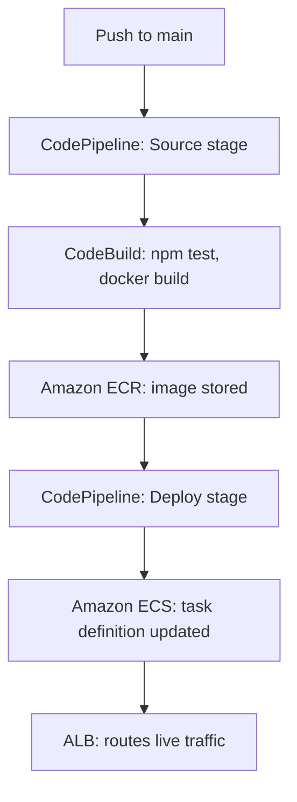

# cinetrack-api

cinetrack-api is a containerised Node.js/Express service deployed on AWS ECS Fargate behind an Application Load Balancer, with a fully automated CI/CD pipeline built on AWS CodePipeline and CodeBuild. The defining feature of this project isn't just the API itself — it's that every push to `main` is automatically tested, containerised, and shipped to a live, publicly reachable service with zero manual steps in the AWS console. This was built as a portfolio project to demonstrate a production-style deployment workflow end to end, not just a diagram of one.

## Table of contents

- [Overview](#overview)
- [Architecture](#architecture)
- [How the pipeline actually works](#how-the-pipeline-actually-works)
- [Tech stack](#tech-stack)
- [Prerequisites](#prerequisites)
- [Getting started locally](#getting-started-locally)
- [Running with Docker](#running-with-docker)
- [Deployment](#deployment)
- [Health check](#health-check)
- [Troubleshooting notes](#troubleshooting-notes)
- [Author](#author)

## Overview

At a glance, this repository contains an Express API, a `Dockerfile` describing how to containerise it, and a `buildspec.yml` telling AWS CodeBuild how to test, build, and publish it. What makes it worth looking at isn't any single one of those files — it's how they connect into a single automated chain: write code, push it, and within a few minutes it's live, with no human touching the AWS console in between.

## Architecture



## How the pipeline actually works

**Source stage.** CodePipeline is connected to this repository through a GitHub App connection — a persistent, authorised link between AWS and GitHub (set up once via OAuth in the console), distinct from a personal access token. With "Detect Changes" enabled, any push to `main` fires a webhook that starts a new pipeline execution automatically. No polling, no manual trigger.

**Build stage.** AWS CodeBuild picks up the source code and runs the commands defined in `buildspec.yml`: `npm ci` for a clean, reproducible install straight from the lockfile, `npm test` to catch regressions before anything gets deployed, then a Docker build and a push of the resulting image to Amazon ECR (Elastic Container Registry — AWS's private Docker registry). The build also writes `imagedefinitions.json`, a small JSON file naming the container and the exact image URI just pushed. That file is the handoff contract to the next stage — it's how Deploy knows precisely which image to roll out without anything being hardcoded.

**Deploy stage.** CodePipeline reads `imagedefinitions.json` and registers a new **ECS task definition revision** — the blueprint for a single running container: which image, how much CPU/memory it gets, which ports it exposes, which environment variables and IAM role it runs with. ECS task definitions are immutable once created, so every deploy creates a new numbered revision rather than editing one in place — this is what makes rollback possible: if a new revision misbehaves, ECS can simply be pointed back at the previous one. The ECS **service** (`cinetrack-service`, running on cluster `cinetrack-cluster`) is then updated to use the new revision, and ECS handles the rollout — starting new tasks, waiting for them to pass health checks, registering them with the load balancer's target group, and draining the old tasks once traffic has shifted.

**Going live.** The Application Load Balancer never talks to ECS tasks directly by IP — it routes through a target group, which only contains tasks that have passed repeated health checks against a defined path (`/health`). This is what prevents a broken deploy from ever receiving real traffic: a task has to prove it's healthy before the ALB will send anything to it.

## Tech stack

- **Application:** Node.js, Express
- **Containerisation:** Docker
- **Compute:** AWS ECS on Fargate (serverless containers — no EC2 instances to manage)
- **Registry:** Amazon ECR
- **Networking:** Application Load Balancer, target groups, health checks
- **CI/CD:** AWS CodePipeline, AWS CodeBuild
- **Access control:** AWS IAM (a consolidated customer-managed policy covering ECR, ECS, CodePipeline, CodeBuild, and CloudWatch)

## Prerequisites

- Node.js 20+
- Docker
- AWS CLI v2, configured with credentials that have access to this account
- Git

## Getting started locally

```bash
git clone https://github.com/Zaamaar/cinetrack-api.git
cd cinetrack-api
npm install
npm run dev
```

The service will start on the port defined in your local environment configuration. Copy any example environment file provided in the repo and populate it with your own local values before running.

## Running with Docker

```bash
docker build -t cinetrack-api .
docker run -p 3000:3000 --env-file .env cinetrack-api
```

This builds and runs the exact same image that CodeBuild produces and ships to ECR in the real pipeline — useful for confirming a change behaves the same locally as it will in production before ever pushing.

## Deployment

Deployment is fully automated: pushing to `main` is the only action required. To trigger a deploy manually, without a new commit — useful after an infrastructure change, for example — run:

```bash
aws codepipeline start-pipeline-execution --name cinetrack-pipeline
```

To watch a pipeline execution's progress from the terminal instead of the console:

```bash
aws codepipeline get-pipeline-state \
  --name cinetrack-pipeline \
  --query "stageStates[].{Stage:stageName,Status:latestExecution.status}" \
  --output table
```

## Health check

The live service exposes a health endpoint used both by the ALB's target group and for manual verification after a deploy:

```bash
curl -i https://<your-alb-dns-name>/health
```

```json
{"status":"ok","service":"cinetrack-api"}
```

A `200` here confirms the running container is actually serving traffic — a green pipeline stage in the console only confirms AWS *accepted* the deploy request, not that the service is healthy, so this check matters.

## Troubleshooting notes

A couple of things worth knowing if you're working with this same stack:

- **`ping` against the ALB will always fail with 100% packet loss** — this is expected. AWS load balancers don't respond to ICMP echo requests by default. Use `curl` to test reachability, not `ping`.
- **If the AWS CLI suddenly can't resolve any AWS hostnames** (`Could not connect to the endpoint URL`) but `nslookup` against the same hostname works fine, the fault is almost always your machine's system DNS resolver, not AWS. Check `networksetup -getdnsservers <interface>` — if it's empty, your system is silently failing to use the network's assigned DNS, and setting explicit DNS servers (e.g. `8.8.8.8`, `1.1.1.1`) resolves it immediately.
- **If Cluster name / Service name dropdowns appear empty** when configuring an ECS deploy stage in the CodePipeline console, click directly into the field — these are search-triggered, not pre-populated, and often just need the interaction to fire the lookup.

## Author

Tom Ayorinde — [github.com/Zaamaar](https://github.com/Zaamaar)
